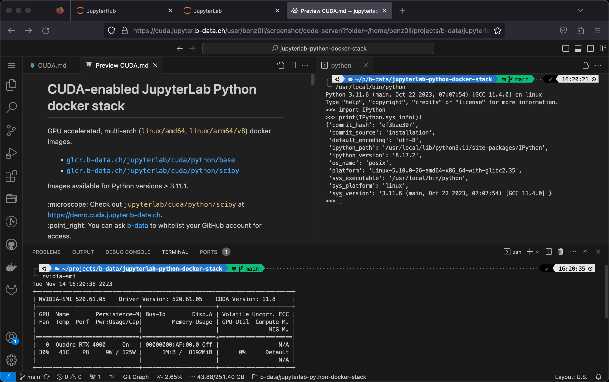

# CUDA-enabled JupyterLab Python docker stack

GPU accelerated, multi-arch (`linux/amd64`, `linux/arm64/v8`) docker images:

* [`glcr.b-data.ch/jupyterlab/cuda/python/base`](https://gitlab.b-data.ch/jupyterlab/cuda/python/base/container_registry)
* [`glcr.b-data.ch/jupyterlab/cuda/python/scipy`](https://gitlab.b-data.ch/jupyterlab/cuda/python/scipy/container_registry)

Images available for Python versions ≥ 3.11.1.

:microscope: Check out `jupyterlab/cuda/python/scipy` at
https://demo.cuda.jupyter.b-data.ch.



**Build chain**

The same as the
[JupyterLab Python docker stack](README.md#jupyterlab-python-docker-stack).

**Features**

The same as the
[JupyterLab Python docker stack](README.md#jupyterlab-python-docker-stack) plus

* CUDA runtime,
  [CUDA math libraries](https://developer.nvidia.com/gpu-accelerated-libraries),
  [NCCL](https://developer.nvidia.com/nccl) and
  [cuDNN](https://developer.nvidia.com/cudnn)
  * including development libraries and headers
* TensortRT and TensorRT plugin libraries
  * including development libraries and headers

:point_right: See the [CUDA Version Matrix](CUDA_VERSION_MATRIX.md) for detailed
information.

**Subtags**

The same as the
[JupyterLab Python docker stack](README.md#jupyterlab-python-docker-stack).

## Table of Contents

* [Prerequisites](#prerequisites)
* [Install](#install)
* [Usage](#usage)
* [Similar projects](#similar-projects)

## Prerequisites

The same as the
[JupyterLab Python docker stack](README.md#prerequisites) plus

* NVIDIA GPU
* NVIDIA Linux driver
* NVIDIA Container Toolkit

:information_source: The host running the GPU accelerated images only requires
the NVIDIA driver, the CUDA toolkit does not have to be installed.

## Install

To install the NVIDIA Container Toolkit, follow the instructions for your
platform:

* [Installation Guide &mdash; NVIDIA Cloud Native Technologies documentation](https://docs.nvidia.com/datacenter/cloud-native/container-toolkit/install-guide.html#supported-platforms)

## Usage

### Build image (base)

latest:

```bash
cd base && docker build \
  --build-arg BASE_IMAGE=ubuntu \
  --build-arg BASE_IMAGE_TAG=22.04 \
  --build-arg BUILD_ON_IMAGE=glcr.b-data.ch/cuda/python/ver \
  --build-arg PYTHON_VERSION=3.12.3 \
  --build-arg CUDA_IMAGE_FLAVOR=devel \
  -t jupyterlab/cuda/python/base \
  -f latest.Dockerfile .
```

version:

```bash
cd base && docker build \
  --build-arg BASE_IMAGE=ubuntu \
  --build-arg BASE_IMAGE_TAG=22.04 \
  --build-arg BUILD_ON_IMAGE=glcr.b-data.ch/cuda/python/ver \
  --build-arg CUDA_IMAGE_FLAVOR=devel \
  -t jupyterlab/cuda/python/base:MAJOR.MINOR.PATCH \
  -f MAJOR.MINOR.PATCH.Dockerfile .
```

For `MAJOR.MINOR.PATCH` ≥ `3.11.1`.

### Create home directory

Create an empty directory using docker:

```bash
docker run --rm \
  -v "${PWD}/jupyterlab-jovyan":/dummy \
  alpine chown 1000:100 /dummy
```

It will be *bind mounted* as the JupyterLab user's home directory and
automatically populated.  
:exclamation: *Bind mounting* a subfolder of the home directory is only possible
for images with Python version ≥ 3.12.2.

### Run container

self built:

```bash
docker run -it --rm \
  --gpus '"device=all"' \
  -p 8888:8888 \
  -u root \
  -v "${PWD}/jupyterlab-jovyan":/home/jovyan \
  -e NB_UID=$(id -u) \
  -e NB_GID=$(id -g) \
  -e CHOWN_HOME=yes \
  -e CHOWN_HOME_OPTS='-R' \
  jupyterlab/cuda/python/base[:MAJOR.MINOR.PATCH]
```

from the project's GitLab Container Registries:

```bash
docker run -it --rm \
  --gpus '"device=all"' \
  -p 8888:8888 \
  -u root \
  -v "${PWD}/jupyterlab-jovyan":/home/jovyan \
  -e NB_UID=$(id -u) \
  -e NB_GID=$(id -g) \
  -e CHOWN_HOME=yes \
  -e CHOWN_HOME_OPTS='-R' \
  IMAGE[:MAJOR[.MINOR[.PATCH]]]
```

`IMAGE` being one of

* [`glcr.b-data.ch/jupyterlab/cuda/python/base`](https://gitlab.b-data.ch/jupyterlab/cuda/python/base/container_registry)
* [`glcr.b-data.ch/jupyterlab/cuda/python/scipy`](https://gitlab.b-data.ch/jupyterlab/cuda/python/scipy/container_registry)

The use of the `-v` flag in the command mounts the empty directory on the host
(`${PWD}/jupyterlab-jovyan` in the command) as `/home/jovyan` in the container.

`-e NB_UID=$(id -u) -e NB_GID=$(id -g)` instructs the startup script to switch
the user ID and the primary group ID of `${NB_USER}` to the user and group ID of
the one executing the command.

`-e CHOWN_HOME=yes -e CHOWN_HOME_OPTS='-R'` instructs the startup script to
recursively change the `${NB_USER}` home directory owner and group to the
current value of `${NB_UID}` and `${NB_GID}`.  
:information_source: This is only required for the first run.

The server logs appear in the terminal.

#### Using Podman (rootless mode, 3.11.6+)

Create an empty home directory:

```bash
mkdir "${PWD}/jupyterlab-root"
```

Use the following command to run the container as `root`:

```bash
podman run -it --rm \
  --device 'nvidia.com/gpu=all' \
  -p 8888:8888 \
  -u root \
  -v "${PWD}/jupyterlab-root":/home/root \
  -e NB_USER=root \
  -e NB_UID=0 \
  -e NB_GID=0 \
  -e NOTEBOOK_ARGS="--allow-root" \
  IMAGE[:MAJOR[.MINOR[.PATCH]]]
```

#### Using Docker Desktop

[Creating a home directory](#create-home-directory) *might* not be required.
Also

```bash
docker run -it --rm \
  --gpus '"device=all"' \
  -p 8888:8888 \
  -v "${PWD}/jupyterlab-jovyan":/home/jovyan \
  IMAGE[:MAJOR[.MINOR[.PATCH]]]
```

*might* be sufficient.

## Similar projects

* [iot-salzburg/gpu-jupyter](https://github.com/iot-salzburg/gpu-jupyter)
* [prp/jupyter-stack](https://gitlab.nrp-nautilus.io/prp/jupyter-stack)

**What makes this project different:**

1. Multi-arch: `linux/amd64`, `linux/arm64/v8`
1. Derived from [`nvidia/cuda:12.5.0-devel-ubuntu22.04`](https://hub.docker.com/r/nvidia/cuda/tags?page=1&name=12.5.0-devel-ubuntu22.04)
    * including development libraries and headers
1. TensortRT and TensorRT plugin libraries
    * including development libraries and headers
1. IDE: [code-server](https://github.com/coder/code-server) next to
   [JupyterLab](https://github.com/jupyterlab/jupyterlab)
1. Just Python – no [Conda](https://github.com/conda/conda) /
   [Mamba](https://github.com/mamba-org/mamba)

See [Notes](NOTES.md) for tweaks, settings, etc.
