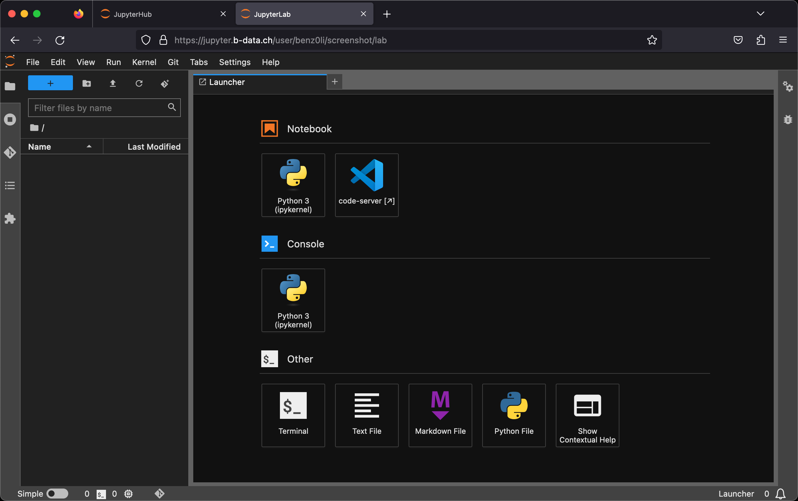

[](https://github.com/RichardLitt/standard-readme/blob/master/example-readmes/minimal-readme.md) [](https://www.repostatus.org/#active) <a href="https://liberapay.com/benz0li/donate"></a>

| See the [CUDA-enabled JupyterLab Python docker stack](CUDA.md) for GPU accelerated docker images. |
|:--------------------------------------------------------------------------------------------------|

# JupyterLab Python docker stack

Multi-arch (`linux/amd64`, `linux/arm64/v8`) docker images:

* [`glcr.b-data.ch/jupyterlab/python/base`](https://gitlab.b-data.ch/jupyterlab/python/base/container_registry)
* [`glcr.b-data.ch/jupyterlab/python/scipy`](https://gitlab.b-data.ch/jupyterlab/python/scipy/container_registry)

Images considered stable for Python versions ≥ 3.10.5.

:microscope: Check out `jupyterlab/python/scipy` at https://demo.jupyter.b-data.ch.



**Build chain**

base → scipy

**Features**

* **JupyterLab**: A web-based interactive development environment for Jupyter
   notebooks, code, and data. The images include
  * **code-server**: VS Code in the browser without MS
    branding/telemetry/licensing.
  * **Git**: A distributed version-control system for tracking changes in source
    code.
  * **Git LFS**: A Git extension for versioning large files.
  * **Pandoc**: A universal markup converter.
  * **Python**: An interpreted, object-oriented, high-level programming language
    with dynamic semantics.
  * **Quarto**: A scientific and technical publishing system built on Pandoc.  
    :information_source: scipy image
  * **TinyTeX**: A lightweight, cross-platform, portable, and easy-to-maintain
    LaTeX distribution based on TeX Live.  
    :information_source: scipy image
  * **Zsh**: A shell designed for interactive use, although it is also a
    powerful scripting language.

:point_right: See the [Version Matrix](VERSION_MATRIX.md) for detailed
information.

The following extensions are pre-installed for **code-server**:

* [.gitignore Generator](https://github.com/piotrpalarz/vscode-gitignore-generator)
* [Black Formatter](https://open-vsx.org/extension/ms-python/black-formatter)  
  :information_source: devtools subtags
* [Docker](https://open-vsx.org/extension/ms-azuretools/vscode-docker)  
  :information_source: docker subtags
* [EditorConfig for VS Code](https://open-vsx.org/extension/EditorConfig/EditorConfig)
  (3.11.3+)
* [ESLint](https://open-vsx.org/extension/dbaeumer/vscode-eslint)  
  :information_source: devtools subtags
* [Git Graph](https://open-vsx.org/extension/mhutchie/git-graph)
* [GitHub Pull Requests and Issues](https://open-vsx.org/extension/GitHub/vscode-pull-request-github)
  (3.11.5+)
* [GitLab Workflow](https://open-vsx.org/extension/GitLab/gitlab-workflow)
* [GitLens — Git supercharged](https://open-vsx.org/extension/eamodio/gitlens)  
  :information_source: Pinned to version 11.7.0 due to unsolicited AI content (3.11.4+)
* [Excel Viewer](https://open-vsx.org/extension/GrapeCity/gc-excelviewer)
* [hadolint](https://open-vsx.org/extension/exiasr/hadolint)  
  :information_source: docker subtags (3.11.4+)
* [Jupyter](https://open-vsx.org/extension/ms-toolsai/jupyter)
* [LaTeX Workshop](https://open-vsx.org/extension/James-Yu/latex-workshop)  
  :information_source: scipy image
* [markdownlint](https://open-vsx.org/extension/DavidAnson/vscode-markdownlint)
  (3.11.6+)
* [Path Intellisense](https://open-vsx.org/extension/christian-kohler/path-intellisense)
* [Prettier - Code formatter](https://open-vsx.org/extension/esbenp/prettier-vscode)  
  :information_source: devtools subtags
* [Project Manager](https://open-vsx.org/extension/alefragnani/project-manager)
* [Python](https://open-vsx.org/extension/ms-python/python)
* [Quarto](https://open-vsx.org/extension/quarto/quarto)  
  :information_source: scipy image
* Resource Monitor (3.11.4+)
* [ShellCheck](https://open-vsx.org/extension/timonwong/shellcheck)
  :information_source: devtools and docker subtags (3.11.4+)
* [YAML](https://open-vsx.org/extension/redhat/vscode-yaml)

**Subtags**

* `{PYTHON_VERSION,latest}-root` (versions ≥ 3.10.5): Container runs as `root`
* `{PYTHON_VERSION,latest}-devtools` (versions ≥ 3.10.5): Includes the
  requirements according to
  * [coder/code-server > Docs > Contributing](https://github.com/coder/code-server/blob/main/docs/CONTRIBUTING.md)
  * [microsoft/vscode-python > Wiki > Coding](https://github.com/microsoft/vscode-python/wiki/Coding)
* `{PYTHON_VERSION,latest}-devtools-root`: The combination of both
* `{PYTHON_VERSION,latest}-docker` (versions ≥ 3.10.11, versions ≥ 3.11.2):
  Includes
  * `docker-ce-cli`
  * `docker-buildx-plugin`
  * `docker-compose-plugin`
  * `docker-scan-plugin` (amd64 only)
* `{PYTHON_VERSION,latest}-docker-root`: The combination of both
* `{PYTHON_VERSION,latest}-devtools-docker`: The combination of both
* `{PYTHON_VERSION,latest}-devtools-docker-root`: The combination of all three

## Table of Contents

* [Prerequisites](#prerequisites)
* [Install](#install)
* [Usage](#usage)
* [Similar projects](#similar-projects)
* [Contributing](#contributing)
* [License](#license)

## Prerequisites

This projects requires an installation of docker.

## Install

To install docker, follow the instructions for your platform:

* [Install Docker Engine | Docker Documentation > Supported platforms](https://docs.docker.com/engine/install/#supported-platforms)
* [Post-installation steps for Linux](https://docs.docker.com/engine/install/linux-postinstall/)

## Usage

### Build image (base)

*latest*:

```bash
cd base && docker build \
  --build-arg PYTHON_VERSION=3.11.6 \
  -t jupyterlab/python/base \
  -f latest.Dockerfile .
```

*version*:

```bash
cd base && docker build \
  -t jupyterlab/python/base:MAJOR.MINOR.PATCH \
  -f MAJOR.MINOR.PATCH.Dockerfile .
```

For `MAJOR.MINOR.PATCH` ≥ `3.10.5`.

### Create home directory

Create an empty directory using docker:

```bash
docker run --rm \
  -v "${PWD}/jupyterlab-jovyan":/dummy \
  alpine chown 1000:100 /dummy
```

It will be *bind mounted* as the JupyterLab user's home directory and
automatically populated on first run.

### Run container

| :exclamation: Always mount the user's **entire** home directory.<br>Mounting a subfolder prevents the container from starting.[^1] |
|:-----------------------------------------------------------------------------------------------------------------------------------|

[^1]: The only exception is the use case described at [Jupyter Docker Stacks > Quick Start > Example 2](https://github.com/jupyter/docker-stacks#quick-start).

self built:

```bash
docker run -it --rm \
  -p 8888:8888 \
  -u root \
  -v "${PWD}/jupyterlab-jovyan":/home/jovyan \
  -e NB_UID=$(id -u) \
  -e NB_GID=$(id -g) \
  -e CHOWN_HOME=yes \
  -e CHOWN_HOME_OPTS='-R' \
  jupyterlab/python/base[:MAJOR.MINOR.PATCH]
```

from the project's GitLab Container Registries:

```bash
docker run -it --rm \
  -p 8888:8888 \
  -u root \
  -v "${PWD}/jupyterlab-jovyan":/home/jovyan \
  -e NB_UID=$(id -u) \
  -e NB_GID=$(id -g) \
  -e CHOWN_HOME=yes \
  -e CHOWN_HOME_OPTS='-R' \
  IMAGE[:MAJOR[.MINOR[.PATCH]]]
```

`IMAGE` being one of

* [`glcr.b-data.ch/jupyterlab/python/base`](https://gitlab.b-data.ch/jupyterlab/python/base/container_registry)
* [`glcr.b-data.ch/jupyterlab/python/scipy`](https://gitlab.b-data.ch/jupyterlab/python/scipy/container_registry)

The use of the `-v` flag in the command mounts the empty directory on the host
(`${PWD}/jupyterlab-jovyan` in the command) as `/home/jovyan` in the container.

`-e NB_UID=$(id -u) -e NB_GID=$(id -g)` instructs the startup script to switch
the user ID and the primary group ID of `${NB_USER}` to the user and group ID of
the one executing the command.

`-e CHOWN_HOME=yes -e CHOWN_HOME_OPTS='-R'` instructs the startup script to
recursively change the `${NB_USER}` home directory owner and group to the
current value of `${NB_UID}` and `${NB_GID}`.  
:information_source: This is only required for the first run.

The server logs appear in the terminal.

#### Using Podman (rootless mode, 3.11.5+)

Create an empty home directory:

```bash
mkdir "${PWD}/jupyterlab-root"
```

Use the following command to run the container as `root`:

```bash
podman run -it --rm \
  -p 8888:8888 \
  -u root \
  -v "${PWD}/jupyterlab-root":/home/root \
  -e NB_USER=root \
  -e NB_UID=0 \
  -e NB_GID=0 \
  IMAGE[:MAJOR[.MINOR[.PATCH]]] start-notebook.sh --allow-root
```

#### Using Docker Desktop

[Creating a home directory](#create-home-directory) *might* not be required.
Also

```bash
docker run -it --rm \
  -p 8888:8888 \
  -v "${PWD}/jupyterlab-jovyan":/home/jovyan \
  IMAGE[:MAJOR[.MINOR[.PATCH]]]
```

*might* be sufficient.

### Credential storage

**:exclamation: Keyring services are not available due to the difficulties of**
**setting them up in containers.**  
**Therefore, provide login credentials for the following extensions as**
**environment variables (`-e`):**

| Extension                       | Environment variable                                                                                                                                                |
|:--------------------------------|:--------------------------------------------------------------------------------------------------------------------------------------------------------------------|
| GitHub Pull Requests and Issues | `GITHUB_TOKEN`: Personal access token with scopes `repo` and `user`.[^2]                                                                                            |
| GitLab Workflow                 | `GITLAB_WORKFLOW_INSTANCE_URL`: GitLab instance URL (e.g. https://gitlab.com).<br>`GITLAB_WORKFLOW_TOKEN`: Personal access token with scopes `api` and `read_user`. |

[^2]: *Device activation* may require a one-time login from the extension's sidebar.

## Similar projects

* [jupyter/docker-stacks](https://github.com/jupyter/docker-stacks)
* [geocompx/docker](https://github.com/geocompx/docker)

What makes this project different:

1. Multi-arch: `linux/amd64`, `linux/arm64/v8`  
   :information_source: Runs on Apple M series using Docker Desktop.
1. Base image: [Debian](https://hub.docker.com/_/debian) instead of
   [Ubuntu](https://hub.docker.com/_/ubuntu)  
   :information_source: CUDA-enabled images are Ubuntu-based.
1. IDE: [code-server](https://github.com/coder/code-server) next to
   [JupyterLab](https://github.com/jupyterlab/jupyterlab)  
   :information_source: code-server = VS Code in the browser.
1. Just Python – no [Conda](https://github.com/conda/conda) /
   [Mamba](https://github.com/mamba-org/mamba)

See [Notes](NOTES.md) for tweaks, settings, etc.

## Contributing

PRs accepted.

This project follows the
[Contributor Covenant](https://www.contributor-covenant.org)
[Code of Conduct](CODE_OF_CONDUCT.md).

## License

[MIT](LICENSE) © 2022 b-data GmbH
